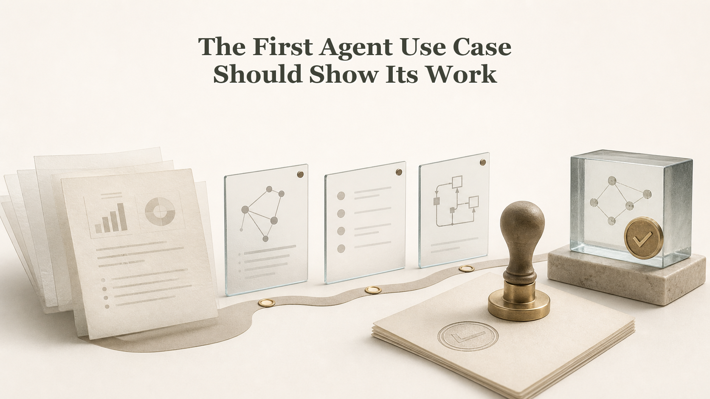

# The First Agent Use Case Should Show Its Work

## Illustration Note

Reference-style review-path diagram showing inference, evidence, review, approval, and shared memory as a visible sequence before action.

## Why This One

This is the clearest near-term LinkedIn angle because it challenges the rush toward full autonomy and explains why traceable work is the safer first win.

## LinkedIn Post - Argument

The first useful AI agent use case should not be the one that acts alone. It should be the one that shows its work.

That may sound too slow. Many teams want the agent to decide, act, and move on.

But in real data product work, the hard part is not only the answer. The hard part is knowing which goal, owner, rule, product, and evidence led to that answer.

A useful first agent can start with one product issue. It follows the links to the use case, the business goal, the owner, and the evidence. Then it shows the path before anyone changes anything.

This is where trust starts. A fast answer is weak if the team cannot see how it was made.

The practical step is simple. Start with agent work that can be reviewed, replayed, and challenged before it becomes action. I wrote more about this path from data product portfolio to shared memory here: https://jarkkomoilanen.com/insights/articles/from-data-product-portfolio-to-shared-memory-for-ai-agents/

## LinkedIn Post - Story

A team asks an AI agent what should be fixed first in a data product portfolio. The agent gives an answer in seconds.

At first, that feels impressive. Then someone asks the useful question: what did it look at?

The weak agent has no good reply. It saw text, guessed the pattern, and gave a neat answer. But it cannot show the use case, rule, owner, evidence, or review point behind the result.

The better agent is less dramatic. It starts from one known product, follows the graph around it, collects the needed facts, and shows each step.

That is not a small detail. It is the difference between a demo and a work system.

The first agent use case should make the work visible before it makes the decision. I wrote about this as shared memory for data product portfolios here: https://jarkkomoilanen.com/insights/articles/from-data-product-portfolio-to-shared-memory-for-ai-agents/

## Supporting Blog Post

- [From Data Product Portfolio to Shared Memory for AI Agents](https://jarkkomoilanen.com/insights/articles/from-data-product-portfolio-to-shared-memory-for-ai-agents/)
- [Agentic Data Product Operations: The Next Maturity Layer for AI Data Product Management](https://jarkkomoilanen.com/insights/articles/agentic-data-product-operations-the-next-maturity-layer-for-ai-data-product-management/)

## Article Seed

- Working title: The First Agent Use Case Should Show Its Work
- Core claim: Agent adoption should start with visible, reviewable work before autonomous action.
- Suggested outline:
  - The rush toward agent autonomy
  - Why answers without trace are weak
  - A safer first use case: inspect, collect, show, review
  - How shared memory makes this repeatable
- Risk to avoid: Do not sound anti-agent; the point is sequencing, not resistance.
