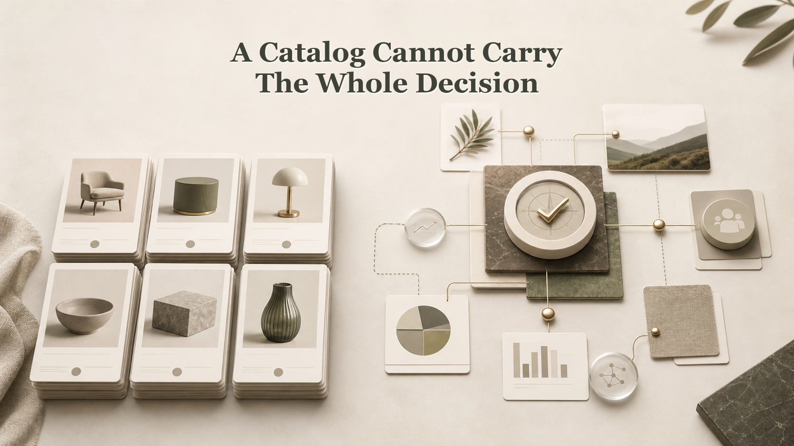

# A Catalog Cannot Carry the Whole Decision

## Illustration Note

Reference-style comparison diagram showing a catalog inventory panel on the left and a separate decision-context graph on the right.

## Why This One

This reframes the catalog vs graph point as a leadership decision problem, which is more useful for LinkedIn than repeating the system architecture difference.

## LinkedIn Post - Argument

A catalog can tell you what exists. It cannot carry the whole decision.

That gap becomes clear when leaders ask what should be funded, changed, stopped, or joined together.

A product entry can show the owner, status, domain, and basic facts. Those are useful. But the decision also needs the goal, use case, evidence, risk, dependency, and reason for change.

This is why many portfolio talks stay weak. The team has a list of products, but not the story of how they affect each other.

A better decision view starts with the relationships. Which use cases need the same product? Which products support the same goal? Which signal changes the priority?

The practical point is not to throw away the catalog. Keep it as inventory, but do not ask it to do the job of an operating model. I explain this Maysano design choice here: https://jarkkomoilanen.com/insights/articles/why-a-data-product-catalog-was-not-enough-for-maysano/

## LinkedIn Post - Story

Picture a steering meeting with a clean data product catalog on the screen. Every product has a name, owner, status, and domain.

The list looks tidy. Then the first hard question arrives: which of these should we invest in next?

The catalog helps, but it does not answer the question. It shows what exists. It does not show which products serve the same goal, which use cases repeat across teams, or where one change affects another plan.

That is where the discussion often becomes political. People argue from their own project view because the shared decision view is missing.

The missing part is not another column. It is the set of relationships around the products.

A catalog should manage inventory. A graph should carry the decision context around the portfolio. I wrote about why this mattered for Maysano here: https://jarkkomoilanen.com/insights/articles/why-a-data-product-catalog-was-not-enough-for-maysano/

## Supporting Blog Post

- [Why a Data Product Catalog Was Not Enough for Maysano](https://jarkkomoilanen.com/insights/articles/why-a-data-product-catalog-was-not-enough-for-maysano/)
- [Golden Data Product Portfolio](https://jarkkomoilanen.com/insights/articles/golden-data-product-portfolio/)

## Article Seed

- Working title: A Catalog Cannot Carry the Whole Decision
- Core claim: Catalogs are useful for inventory, but portfolio decisions need relationship context.
- Suggested outline:
  - The clean catalog meeting
  - The first hard investment question
  - Why product records cannot hold all context
  - How relationship views improve decisions
- Risk to avoid: Do not frame catalogs as bad; the point is role clarity.
