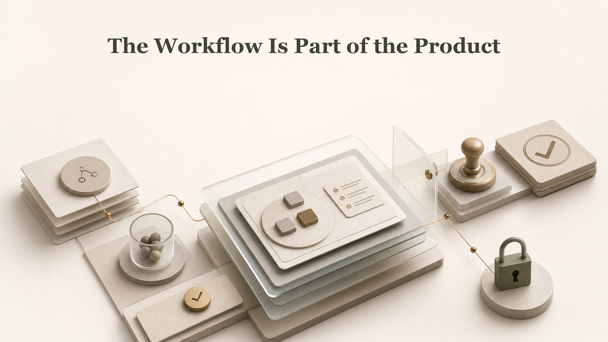

# The Workflow Is Part of the Product

## Illustration Note

Reference-style layered diagram showing an operating workflow above data products, with evidence, review, approval, quality, access, and audit as visible controls.

## Why This One

This creates a new communication route from the article corpus: not graph, catalog, or standards first, but the hidden workflow that decides whether data product work can be trusted.

## LinkedIn Post - Argument

A data product is not only the data, owner, and access path. The workflow around it is part of the product.

This becomes obvious when an AI agent enters the work. The agent does not know the team habits that people use to stay safe.

People know who to ask before a change. They know which report is trusted, which ticket matters, and when a review is needed. Agents need that made visible.

If the workflow is hidden, the agent must guess. That is not an agent problem. It is an operating model problem.

The practical lesson is clear. Treat review steps, evidence rules, allowed actions, and stopping points as product material, not background process.

This is why agentic data product work needs visible operations, not only better documentation. I wrote about that maturity layer here: https://jarkkomoilanen.com/insights/articles/agentic-data-product-operations-the-next-maturity-layer-for-ai-data-product-management/

## LinkedIn Post - Story

A data product looks ready in the catalog. It has an owner, description, access method, and quality notes.

Then a change request arrives. A person knows what to do next because they know the team habit.

They know which approval is real. They know which evidence must be checked. They know when to pause, even if the system does not say it.

An AI agent does not have that hidden memory. If the workflow is not written, linked, and governed, the agent has to guess its way through the work.

That is why workflow design is not admin work. It is part of making the data product safe to operate.

The next maturity layer is to make the work visible enough for people and agents to follow the same rules. I wrote about agentic data product operations here: https://jarkkomoilanen.com/insights/articles/agentic-data-product-operations-the-next-maturity-layer-for-ai-data-product-management/

## Supporting Blog Post

- [Agentic Data Product Operations: The Next Maturity Layer for AI Data Product Management](https://jarkkomoilanen.com/insights/articles/agentic-data-product-operations-the-next-maturity-layer-for-ai-data-product-management/)
- [Data Product Standards Must Become AI Agent Native](https://jarkkomoilanen.com/insights/articles/data-product-standards-must-become-ai-agent-native/)

## Article Seed

- Working title: The Workflow Is Part of the Product
- Core claim: Data products are not safe for agentic work unless their workflows are visible and governed.
- Suggested outline:
  - A complete product record is not enough
  - People compensate with hidden habits
  - Agents expose the missing workflow
  - Workflows as operating assets
- Risk to avoid: Avoid making it sound like process bureaucracy; keep it tied to trust and action.
